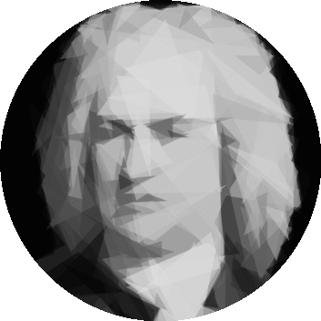

# bach

> :musical_score: Semantic music notation

---

[](https://circleci.com/gh/slurmulon/bach)
[](https://clojars.org/bach)

<p align="center"></p>

## Sections

- [What](#what)
- [Goals](#goals)
- [Design](#design)
- [Examples](#examples)
- [Install](#install)
- [Setup](#setup)
- [Testing](#testing)
- [Usage](#usage)
  * [CLI](#cli)
  * [Library](#library)
- [JavaScript](#javascript)
- [Documentation](#documentation)
  * [Beats](#beats)
    - [Lists](#lists)
    - [Sets](#sets)
    - [Nesting](#nesting)
    - [Durations](#durations)
    - [Instantiation](#instantiation)
    - [Implicits](#implicits)
  * [Variables](#variables)
  * [Cadences](#cadences)
  * [Attributes](#attributes)
  * [Headers](#headers)
  * [Play](#play)
- [Constructs](#constructs)
  * [Elements](#elements)
  * [Headers](#headers-1)
  * [Operators](#operators)
  * [Primitives](#primitives)
- [Related](#related)
- [Help](#help)
- [Contributing](#contributing)
- [Roadmap](#roadmap)

## What

`bach` is a semantic music notation designed to be both human and computer friendly.

Although its primary domain is music, `bach` enables the synchronization of rhythmic timelines with just about anything.

The project is pre-alpha and is not should **not** be considered stable for production use.

## Goals

- Easily support semantic music constructs such as chords and scales
- Seamless synchronization with associated data by minimizing the complexities around timing
- Allow for alternative real-time representations of music (e.g. visual instead of just audio)
- Easy to read for both humans and computers
- Easy to translate from sheet music
- Small learning curve
- Highly productive
- Trivial to interpret compiled output. Writing `bach` engines should be easy!

## Design

`bach` tracks are ultimately interpreted by a higher-level `bach` engine, such as [`gig`](https://github.com/slurmulon/gig).

This module, by itself, can only parse and compile plaintext `bach` data into [`bach.json`](https://github.com/slurmulon/bach-json-schema).

`bach.json` is a JSON micro-format that makes it trivial for `bach` engines to sequentially process a `bach` music track and synchronize it in real-time with audio.

## Examples

For the sake of brevity, the examples found in this document all represent short and repeatable loops of music.

### Intro

The following `bach` track represents a loopable scale progression for a blues song:

```bach
@Meter = 4|4
@Tempo = 42

:A = Scale('A3 minorpentatonic')
:D = Scale('D3 minorpentatonic')
:E = Scale('E3 minorpentatonic')

!Play [
  1 -> :A
  1 -> :D
  2 -> :A
  2 -> :D
  2 -> :A
  1 -> :E
  1 -> :D
  2 -> :A
]
```

and is interpreted like so:

1. Scale `:A`, or `A3 minorpentatonic`, will be played for `1` measure, then
1. Scale `:D`, or `D3 minorpentatonic`, will be played for `1` measure, then
1. Scale `:A` will be played for `2` measures, then
1. ... and so on

To find a list of every reserved construct supported by `bach` (such as `Note`, `Chord`, etc.), please refer to the ["Constructs"](https://github.com/slurmulon/bach#constructs) section.

### Basic

```bach
@Meter = 4|4
@Tempo = 44

:B = Chord('Bm')
:E = Chord('Em')
:F = Chord('F#m7')

!Play [
  4 -> {
    Scale('B minor')
    :B
  }
  2 -> :E
  2 -> :B
  2 -> :F
  2 -> :B
]
```

```bach
@Meter = 4|4
@Tempo = 169

!Play [
  7/8 -> {
    Scale('A aeolian')
    Chord('F')
  }
  1 -> Chord('G')
  2 + (1/8) -> Chord('Am')
]
```

```bach
@Meter = 4|4
@Tempo = 130

!Play [
  3/8 -> {
    Scale('G aeolian')
    Chord('Gmin')
  }
  5/8 -> Chord('Eb')
  3/8 -> Chord('Cmin7')
  5/8 -> Chord('Bb')
]
```

### Advanced

#### Compound meters

```bach
@Meter = 12|8
@Tempo = 150

!Play [
  12/8 -> {
    Scale('A minor')
    Chord('A')
  }
  12/8 -> Chord('A7')
  12/8 -> Chord('D7')
  12/8 -> Chord('D#7')

  6/8 -> Chord('A')
  6/8 -> Chord('F#m7')

  6/8 -> Chord('Bm7')
  6/8 -> Chord('E7')

  6/8 -> Chord('A7')
  6/8 -> Chord('D7')
]
```

#### Mixed meters

```bach
@Meter = 5|8
@Tempo = 150

!Play [
  3/8 -> {
    Scale('D dorian')
    Chord('Dm9')
  }
  2/8 -> Chord('Am9')
]
```

```bach
@Meter = 3|4
@Tempo = 100

!Play [
  6/4 -> {
    Scale('C# phrygian')
    Chord('C#m')
  }
  6/4 -> Chord('Dmaj7')
]
```

## Install

### Leinengen/Boot

`[bach "2.0.0-SNAPSHOT"]`

### Gradle

`compile "bach:bach:2.0.0-SNAPSHOT"`

### Maven

```xml
<dependency>
  <groupId>bach</groupId>
  <artifactId>bach</artifactId>
  <version>2.0.0-SNAPSHOT</version>
</dependency>
```

## Setup

To setup a development environment, first clone then repo:

```sh
$ git clone git@github.com:slurmulon/bach.git
```

Then change your current directory to wherever you cloned `bach`, and:

```sh
$ lein install
```

If you want to simultaneously develop `bach` and another library using it, [follow this guide on checkout dependencies](https://github.com/technomancy/leiningen/blob/master/doc/TUTORIAL.md#checkout-dependencies).

## Testing

```sh
$ lein test
```

## Usage

### CLI

First be sure that you have a binary executable (requires `lein` to be installed) available on your `PATH`:

```sh
$ lein bin
```

Then you can execute the resulting binary like so:

```sh
$ target/default/bach-2.0.0-SNAPSHOT -i /path/to/track.bach compile
```

The executable currently supports the following actions:

- `parse`: creates an Abstract Syntax Tree (AST) from vanilla `bach` data
- `compile`: parses and compiles vanilla `bach` data into `bach.json`, an intermediary JSON micro-format that allows for simple interpretation of tracks
- `help`

### Library

```clojure
(ns my.namespace
  (:require [bach.track :refer [compose]]))

; Parses, optimizes and compiles bach data into an interpretable hash-map
(compose "!Play [1 -> Chord('A'), 1 -> Chord('C')]")
```

### Repl

```sh
$ lein -U repl
```

```clojure
(use 'bach.track :reload)

(compose "!Play [1 -> Chord('A'), 1 -> Chord('C')]")
```

## JavaScript

If using Clojure or the JVM in general is not an option, `bach` can also be used via ClojureScript and/or `nodejs`.

Since installation and usage is identical between Clojure and ClojureScript, this section focuses on using `bach` in `nodejs` via `npm`.

As of now only `bach.track/compose` is exported and accessible in `nodejs`, since parsing and validating `bach` into `bach.json` is the primary feature.

### Install

```sh
$ npm i git@github.com:slurmulon/bach.git
```

You should now see `bach-cljs` under `dependencies` in `package.json`.

**ES6+**
```js
import bach from 'bach-cljs'
```

**CommonJS**
```js
const { bach } = require('bach-cljs')
```

### Usage

```node
import bach from 'bach-cljs'

const json = bach("@Tempo = 65 !Play [1 -> Chord('E') 1/2 -> Chord('G#min') 1/2 -> Chord('B')]")

console.log(JSON.stringify(json, null, 2))
```

### Development

```sh
$ npm i
$ lein clean && npm run dev
```

### Releasing

```sh
$ lein clean && npm run build
```

## Documentation

An [Extended Backus-Naur Form (EBNF)](https://en.wikipedia.org/wiki/Extended_Backus%E2%80%93Naur_Form) formatted definition of the grammar can be found in [grammar.bnf](https://github.com/slurmulon/bach/blob/master/resources/grammar.bnf).

### Beats

`Beats` represent either an `Element` or a `Collection` of `Elements` that are played for a duration of time.

`Elements` are either `Chords`, `Scales`, `Notes`, `Rests` (`~`), or `Collections`.

The duration that a `Beat` is played for is specified using the tuple symbol, `->`:

```
<duration> -> <element>
```

#### Lists

`Beats` defined in `Lists` will be played sequentially in the natural order (left to right) and will **not** overlap.

```
[<duration> -> <element>, <duration> -> <element>]
```

#### Sets

`Beats` defined in `Sets` will be played in parallel and may overlap.

```
{<duration> -> <element>, <duration> -> <element>}
```

#### Nesting

Nesting functionality is limited by design, as it helps keep high-level interpretation as linear and simple as possible.

The rules are simple:

 - `Lists` may contain `Sets`
 - `Lists` may **not** contain other `Lists`
 - `Sets` may **not** contain `Sets` or `Lists`

As a result, `Lists` **cannot** be nested in another `Collection` at _any_ level.

#### Durations

The value of a `Beat`'s `<duration>` can be an integer, a fraction, or a mathematical expression composed of either.

```
1    = Whole note (or one entire measure when `@Meter = 4|4`)
1/2  = Half note
1/4  = Quarter note
1/8  = Eighth note
1/16 = Sixteenth note

1/512 = Minimum duration
1024  = Maximum duration

2 + (1/2) = Two and a half whole notes
2 * (6/8) = Two and a half measures when `@Meter = 6|8`
```

To adhere with music theory, durations are strictly based on **common time** (`@Meter = 4|4`).

This means that, in your definitions, `1` always means 4 quarter notes, and only equates with a full measure when the number of beats in a measure is 4 (as in `4|4`, `3|4`, `5|4`, etc.).

The examples in the remainder of this section assume common time, since this is the default when a `@Meter` header is not provided.

##### Examples

A `List` playing a `Note('C2')` for an entire measure, starting at the first `Beat`, would be specified like so:

```
[1 -> Note('C2')]
```

If you wanted to start playing the note on the second `Beat` of the measure, then simply rest (`~`) on the first `Beat`:

```
[1/4 -> ~, 1 -> Note('C2')]
```

When a `Beat` tuple is not provided in an an assignment or a `Collection`, both the position and duration of the `Beat` will be implied at run-time to be the index of each respective element as they are played.

The position and duration are both determined by the time signature (the default is common time, or `4|4`).

For instance:

```
[1/4 -> Note('C2'), 1/4 -> Note('F2')]
```

is the same as:

```
[Note('C2'), Note('F2')]
```

`Beat` durations can also use basic mathematical operators. This makes the translation between sheet music and `bach` an easy task.

```
1 + 1/2 -> Chord'(C2min6')
```

This is usefeul for specifying more complicated rhythms, like those seen in jazz.

```
:PartA = [
  1/2   -> Chord('D2min7')
  1+1/2 -> Chord('E2maj7')
  1+1/2 -> Chord('C2maj7')
]
```

You may also use the `-`, `*` and `/` operators.

#### Instantiation

All `Elements`, unless already nested in a `List` or `Set`, must be instantiated in a `Beat` tuple (or implicitly converted into one, as shown in the previous section).

The first parameter of every `Element` is a string formatted in [`scientific pitch notation (SPN)`](https://en.wikipedia.org/wiki/Scientific_pitch_notation) (surrounded with `'` or `"`) such as `'C2'`, which is a second octave `C` note.

#### Implicits

As a convenience, `Elements` may also be defined implicitly, specified using a `#`:

```
:Note  = #('C2')
:Chord = #('C2Maj7')
:Scale = #('C2 Minor')
```

Determining the semantic value of implicit `Elements` (i.e. whether it's a `Note`, `Chord`, etc.) is the responsibility of the `bach` interpreter.

It's suggested that you primarily use implicits as they will save you a _lot_ of typing over time.

### Variables

To assign a variable, prefix a unique name with the `:` operator and provide a value (`<element>`):

```
:MyLoop = [1 -> Note('C2'), 1 -> Note('E2')]
```

Once assigned a name, variables may be dynamically referenced anywhere else in the track:

```
:CoolLooop = :MyLoop
```

### Cadences

In music it's common to see cadence sections labeled as `A`, `B`, `C`, and so on. `bach`'s syntax favors this nicely:

```
:A = Chord('F2maj')
:B = Chord('G2maj')
:C = Chord('C2maj')

:Song = [
  1 -> :A
  1 -> :B
  1 -> :C
  1 -> :A
]

!Play :Song
```

Destructured list assignments will soon be supported and will also favor cadences (**currently unsupported**):

```
:[A, B, C, D] = [Chord('E7'), Chord('Emin7'), Chord('Cmaj7'), Chord('Dmaj7')]
```

### Attributes

Arbitrary attributes may be associated with `Elements` using the `<key>: <value>` syntax. These attributes allow you to cusotmize the representations and interpretations of your `Elements`.

For instance, colors are useful for succesfully expressing a variety of data to the user at once. You might also want to specify the specific voicing of a chord.

```
:ABC = [
  1 -> {
    Scale('C2min',  color: #6CB359)
    Chord('D2min7', color: #AA5585, voicing: 1)
  },
  1 -> Chord('G2maj7', color: #D48B6A, voicing: 2)
  2 -> Chord('C2maj7', color: #FFDCAA, voicing: 2)
]
```

### Headers

Optional header information, including the **tempo** and **time signature**, is specified with assignments at the top of the file and prefixed with the `@` operator:

Headers outside of those defined in the [documentation](#headers-1) are allowed and can be interpreted freely by the end user, just like `X-` headers in HTTP. The value of custom headers can be of any [primitive type](#primitives).

```
@Meter  = 4|4
@Tempo  = 90
@Title  = 'My bach track'
@Tags   = ['test', 'lullaby']
@Custom = 'so special'

:ABC = [
  1/2 -> Chord('D2min7')
  1/2 -> Chord('G2min7')
  1 -> Chord('C2maj7')
]
```

### Play

Because `bach` supports references, it requires a mechanism for specifying which data should be used for playing the track. You can think of `Play` as your main method or default export.

In other words, you need to tell it which values should ultimately be made available to the `bach` interpreter.

Any `Elements` that aren't being referenced or used by the value exported with `!Play` will be **ignored** during compilation.

```
:Ignored  = [1 -> Chord('D2min6'), 1 -> Chord('A2min9')]
:Utilized = [1 -> Chord('C2Maj7'), 1 -> Chord('A2Maj7')]

!Play :Utilized
```

Only one `!Play` definition is allowed per track file.

## Constructs

### Elements

 - `Note` = Single note in scientific notation
 - `Scale` = Scale in scientific notation
 - `Chord` = Chord in scientific notation
 - `Mode` = Mode in scientific notation
 - `Triad` = Triad of notes in scientific notation
 - `~` = Rest
 - `#` = Implicit (the interpreter determines if it's scale, chord or note based on the notation itself)
 - `[]` = List (sequential / ordered)
 - `{}` = Set (parallel / unordered)

### Headers

#### Reserved

 - **`Tempo`** (number, beats per minute)
 - **`Meter`** (meter, time signature. ex: `6|8`, `4|4`)

#### Useful

 - `Key` (string, key signature)
 - `Audio` (url)
 - `Instrument` (string, arbitrary)
 - `Title` (string, arbitrary)
 - `Artist` (string, arbitrary)
 - `Desc` (string, arbitrary)
 - `Tags` (list or set of strings, arbitrary)
 - `Link` (string, url)

### Operators

 - `+` = Add
 - `-` = Subtract
 - `/` = Divide
 - `*` = Multiply
 - `|` = Meter (for time signatures, **not** arbitrary mathematical expressions)

### Primitives

 - `'foo'` or `"bar"` = string
 - `123` or `4.5` = number
 - `#000000` or `#fff` = color

## Related

- [`bach-json-schema`](https://github.com/slurmulon/bach-json-schema) contains the official JSON Schema definition for the `bach.json` format
- [`bach-rest-api`](https://github.com/slurmulon/bach-rest-api) is a RESTful HTTP service that allows compilation of `bach` tracks into `bach.json`
- [`gig`](https://github.com/slurmulon/gig) is the official NodeJS `bach` interpreter library

## Help

If you encounter any problems or have any questions then please feel free to open up an issue.

## Contributing

Contributions are always welcome. Simply fork, make your changes and then create a pull request with thorough tests.

## Roadmap

 - [ ] Write technical specfiication
 - [X] General work towards making the tracks iterable in a normalized fashion
 - [ ] Refactor headers (rename to "metas") so that they are contextual instead of global
 - [ ] Create `@Dynamics` contextual meta construct (alternatives: `@Intensity`, `@Volume`)
 - [ ] Create `@Accent` contextual meta construct
 - [ ] Replace `!Play` with more generic `export` keyword
 - [ ] Element relationships (e.g. tie, slur, glissando, arpeggiated chord)
 - [ ] Tuplets
 - [ ] Destructured list assignments
 - [ ] Expandable / destructured scales and chords (i.e. `[... 1/4 -> Scale('C2')]`)
 - [ ] Application of collection variables (i.e. dereference and flatten value into surrounding list)
 - [ ] Allow user to define sections of a track that should loop forever
 - [ ] Linkable sections with unique namespaces so that end users may bookmark and/or track progress, or specify areas to loop
 - [x] Arbitrary classification of elements (i.e. `Note('C2', class: "blue")`)
 - [x] Chord voicings/inversions (i.e. `Chord('C2maj7', inversion: 1)`)
